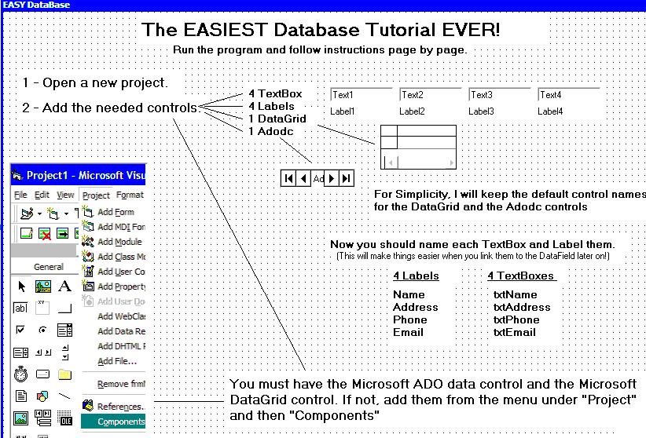



## The EASIEST DataBase Tutorial \- a Picture by Picture guide for the beginner\!

### Description

A VERY simple guide to aid the beginner in creating a simple database.
 
### More Info
 

             |
---                |---
**Submitted On**   |2004-11-23 21:27:56
**By**             |[C\. S\. Trout](https://github.com/Planet-Source-Code/PSCIndex/blob/master/ByAuthor/c-s-trout.md)
**Level**          |Beginner
**User Rating**    |4.8 (38 globes from 8 users)
**Compatibility**  |VB 6\.0
**Category**       |[Databases/ Data Access/ DAO/ ADO](https://github.com/Planet-Source-Code/PSCIndex/blob/master/ByCategory/databases-data-access-dao-ado__1-6.md)
**World**          |[Visual Basic](https://github.com/Planet-Source-Code/PSCIndex/blob/master/ByWorld/visual-basic.md)
**Archive File**   |[The\_EASIES18213211232004\.zip](https://github.com/Planet-Source-Code/c-s-trout-the-easiest-database-tutorial-a-picture-by-picture-guide-for-the-beginner__1-57395/archive/master.zip)

